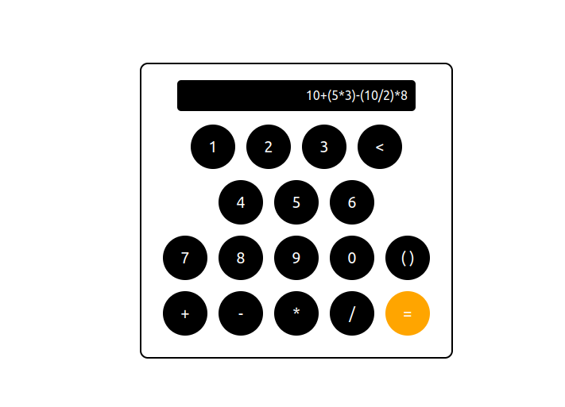

# Calculator Application

## Infix to RPN Conversion and Evaluation

The application utilizes Dijkstra's [Shunting Yard algorithm](https://en.wikipedia.org/wiki/Shunting-yard_algorithm) to convert expressions from infix notation to Reverse Polish Notation (RPN). This approach efficiently prepares the expression for evaluation using a stack-based method.
The Shunting Yard algorithm was coded by me (just for the purpose of practicing), GPT-4 built the UI around it to make it a bit nicer.

## UI Design and Interaction

The user interface around this functionality was created in React and designed with the assistance of OpenAI's GPT-4. Users can input expressions through the UI, which are then sent to a backend server in Flask where the parsing and evaluation occur.

## Screenshots

Below are screenshots demonstrating the application in use:

### Expression Input

### Result Output

